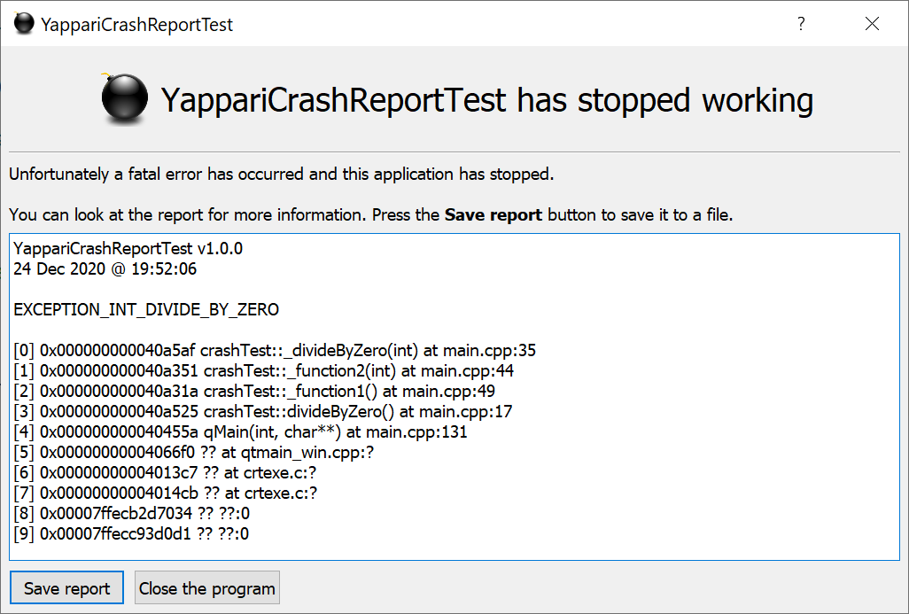
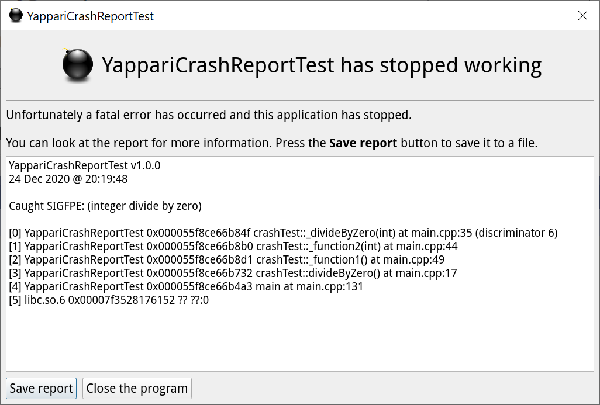
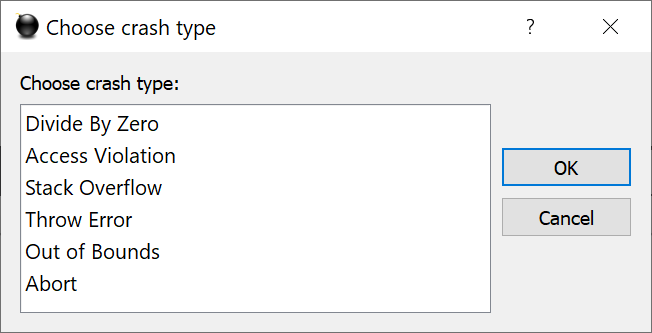

# YappariCrashReport
Based on [asmCrashReport](https://github.com/asmaloney/asmCrashReport) (excellent work by Andy Maloney).

Provides a dialog to show the user the stack trace information from crashes when using the [GNU GCC compiler](http://gcc.gnu.org/) including [MinGW](http://www.mingw.org/) for Windows or the clang compiler for [Qt](https://www.qt.io/)-based applications.

The user can optionally save the stack trace to a file clicking on the **Save report** button.

Supports Windows, Linux and macOS.

## Usage
There are two examples included in this repository.

In your .pro file, you need to include the YappariCrashReport.pri file. e.g.:

```
if ( !include( ../YappariCrashReport.pri ) ) {
    error( Could not find the YappariCrashReport.pri file. )
}
```
This will define **YAPPARI_CRASH_REPORT** for the preprocessor and modify the C/CXX and linker flags to include the debug symbols properly.

In your main.cpp, include the header:

```cpp
#ifdef YAPPARI_CRASH_REPORT
#include "YappariCrashReport.h"
#endif
```

In your *main()* function, set your signal handler *after* you have declared your **QApplication** and set the application name and version number:
```cpp
QApplication  app( argc, argv );

app.setApplicationName( QStringLiteral( "YappariCrashReportExample" ) );
app.setApplicationVersion( QStringLiteral( "1.0.0" ) );

#ifdef YAPPARI_CRASH_REPORT
   YappariCrashReport::setSignalHandler( [] (const QString &inStackTrace) {

       const QStringList strList = QStringList(inStackTrace.split("\n"));
       for (const QString &str : strList)
           qCritical() << str;
   });
#endif
```

*YappariCrashReport::setSignalHandler* has the following prototype:
```cpp
   /// inCrashReportCallback: A callback function to call after we've shown the dialog to the user
   void setSignalHandler( crashReportCallback inCrashReportCallback = nullptr );
```

The callback can be used to send the stack trace to the stderr. Its signature must be this:

```cpp
   /// inCrashReport: The report including the stack trace as a QString
   void crashReportCallback( const QString &inCrashReport );
```
Look at the example and test source code for more information on how to do this.

## Windows (MingW)
Windows needs to be able to find the **addr2line** command line tool.

Currently, YappariCrashReporter will look for this in a tools directory next to the executable (see *YappariCrashReport.cpp*'s **_addr2line()** function).

The prebuilt MinGW Qt installers include **addr2line** in the *bin* directory. It's statically linked so you only need to copy this file to the *tools* directory.

You can find it usually at C:\Qt\Tools\mingw*xxx_xx*\bin.

### Linux
You need to have the *binutils* package installed that includes **addr2line**.

## Examples

In **Windows** the dialog look like this:



For **Linux** it would look like this:



If you run the included test you get to select which type of crash you want to test:



## Main differences with [asmCrashReport](https://github.com/asmaloney/asmCrashReport)

[asmCrashReport](https://github.com/asmaloney/asmCrashReport) saves the stack trace to a log file in subfolder of the Desktop (Windows) or the user's home directory (Linux/macOS).

YappariCrashReport shows a nice dialog to the user and give them the option to save the file or not, in a location of their preference.

Also [asmCrashReport](https://github.com/asmaloney/asmCrashReport) doesn't work on Linux without some modifications that are included in this project.
